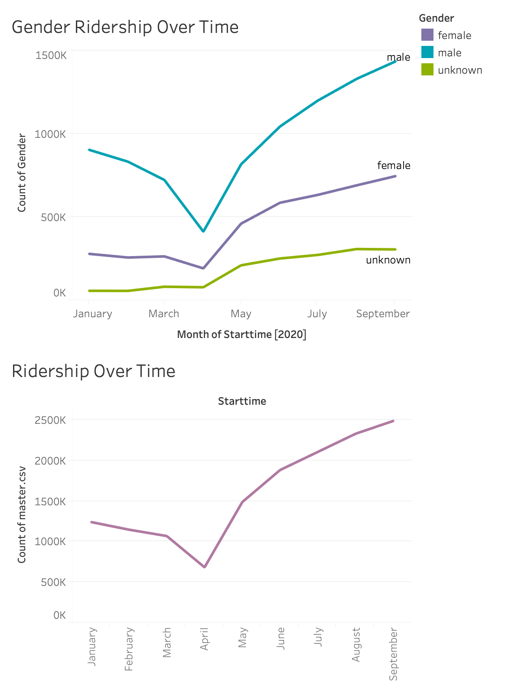
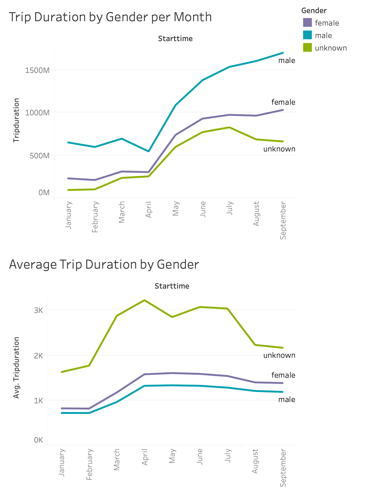

# Citi Bike Data From January 2020 to September 2020

## Data Source
https://s3.amazonaws.com/tripdata/index.html

Multiple files containing 2020 data was downloaded from this website and then concatenated into one master csv file.

# Output

## Contents:

## 1. How has ridership changed from January to September of 2020? 

* Ridership decreased as we moved toward the the start of the lockdowns for covid-19. April was when ridership was at its lowest but it began to increase again in the months following April. 

* Males account for the majority of ridership. In January, men were about 3x more likely to ride the scooters than females.

## 2. User Type from January to September of 2020? 

* From January to April of 2020, the number of subscribers decreased. However, in the months following April, the number of subscribers increased. From the start of 2020, there has been a 58.6% increase in subscribers. 

* The number of customers continued to increase each month throughout 2020 and did not experience a dip in April like we saw with the number of subscribers. During 2020, there has been a 607.5% increase in the number of customers.

## 3. Where are the top 10 Start stations and End Stations? 

* Top 10 Start Stations ():
    1. 12 Ave & W 40 St
    2. West St & Chambers St
    3. W 21 St & 6 Ave
    4. 1 Ave & E 68 St
    5. Broadway & W 60 St
    6. Christopher St & Greenwich St
    7. E 17 St & Broadway 
    8. Pier 40 & Hudson River Park
    9. E 13 St & Avenue A
    10. Broadway & E 22 St

* Top 10 End Stations:
    1. 12 Ave & W 40 St
    2. West St & Chambers St
    3. W 21 St & 6 Ave
    4. 1 Ave & E 68 St
    5. Christopher St & Greenwich St
    6. E 17 St & Broadway 
    7. Broadway & W 60 St
    8. Pier 40 & Hudson River Park
    9. Broadway & E 22 St
    10. E 13 St & Avenue A

## 4. What it the total and average trip duration per month by gender?
* Total Trip Duration
    * For all of the genders, trip duration has increased from January to September
    * Males had longer trip durations than females or unknown.
* Average Trip Duration
    * Males and females have a similar growth in trip duration over the months. 
    * On average, unknown gender riders have longer trip durations than females or males.
 
    
## Map of Start Stations

## Map of End Stations

